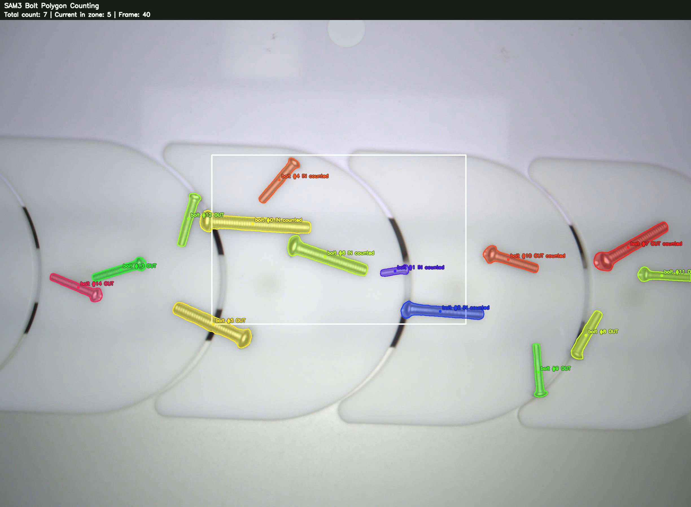
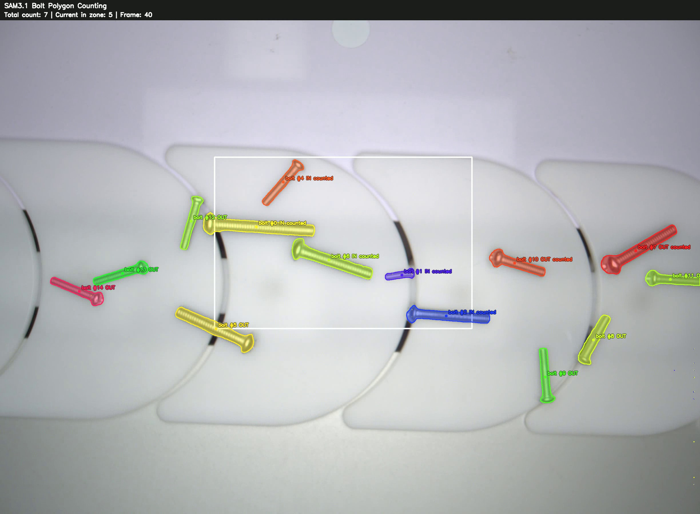

# Conveyor Belt Video Counting

Segmentation-based conveyor belt object tracking and counting using SAM3/SAM3.1 video masks.

This repository focuses on **conveyor belt object counting**.
Small industrial objects on a conveyor belt are tracked using segmentation masks, and object counts are calculated from polygon-zone entry events.

## Preview

<table>
  <tr>
    <td align="center">
      <br>
      <sub><b>SAM3 Polygon Counting</b></sub>
    </td>
    <td align="center">
      <br>
      <sub><b>SAM3.1 Polygon Counting</b></sub>
    </td>
  </tr>
</table>

---

## Overview

The goal of this project is to build a video counting pipeline for conveyor belt environments.

Instead of relying only on bounding boxes, this project uses segmentation masks from SAM3/SAM3.1.
Each object mask is converted into a centroid point, and counting is performed when the centroid enters a predefined polygon zone.

```text
Conveyor video
→ SAM3 / SAM3.1 video segmentation tracking
→ Mask extraction
→ Mask centroid calculation
→ Polygon-zone entry check
→ Object counting
→ Visualization video
```

---

## Demo Videos

### Counting Results

### SAM3 Polygon-Zone Counting: Big Polygon

<p align="center">
  <video src="examples/videos/counting/sam3_polygon_counting_big.mp4" controls width="640"></video>
</p>

[Download video](examples/videos/counting/sam3_polygon_counting_big.mp4)

---

### SAM3 Polygon-Zone Counting: Small Polygon

<p align="center">
  <video src="examples/videos/counting/sam3_polygon_counting_small.mp4" controls width="640"></video>
</p>

[Download video](examples/videos/counting/sam3_polygon_counting_small.mp4)

---

### SAM3.1 Polygon-Zone Counting: Small Polygon

<p align="center">
  <video src="examples/videos/counting/sam31_polygon_counting_small.mp4" controls width="640"></video>
</p>

[Download video](examples/videos/counting/sam31_polygon_counting_small.mp4)

---

## Tracking Results

The tracking videos are stored as experiment outputs under `examples/videos/tracking/`.
They are kept in the repository for comparison, while the README preview focuses on the final counting results.

| Tracking Result      | Description                                | File                                                      |
| -------------------- | ------------------------------------------ | --------------------------------------------------------- |
| SAM3 bolt tracking   | SAM3 video segmentation tracking result    | `examples/videos/tracking/sam3_bolt_tracking.mp4`         |
| SAM3.1 bolt tracking | SAM3.1 tracking with `max_num_objects=32`  | `examples/videos/tracking/sam31_bolt_tracking_max32.mp4`  |
| SAM3.1 bolt tracking | SAM3.1 tracking with `max_num_objects=128` | `examples/videos/tracking/sam31_bolt_tracking_max128.mp4` |

---

## SAM3.1 Max Object Setting

SAM3.1 tracking was tested with different `max_num_objects` settings.

The `max_num_objects` value controls the maximum number of objects that can be tracked in a video session.
For conveyor belt videos, this setting matters because many small objects can appear in the frame at the same time.

```text
max_num_objects=32
→ Lower object capacity
→ Useful for lighter scenes or quick validation

max_num_objects=128
→ Higher object capacity
→ More suitable for dense conveyor belt scenes
```

In this repository, both SAM3.1 tracking results are kept to show the effect of changing the object capacity setting.

---

## Repository Structure

```text
conveyor-belt-video-counting/
├─ scripts/
│  ├─ sam3_segment_video.py
│  ├─ sam31_segment_video.py
│  └─ polygon_zone_counting.py
│
├─ examples/
│  ├─ images/
│  └─ videos/
│     ├─ counting/
│     └─ tracking/
│
├─ README.md
├─ requirements.txt
└─ .gitignore
```

---

## Main Scripts

| File                               | Purpose                                                           |
| ---------------------------------- | ----------------------------------------------------------------- |
| `scripts/sam3_segment_video.py`    | Runs SAM3 video segmentation tracking and saves object masks.     |
| `scripts/sam31_segment_video.py`   | Runs SAM3.1 video segmentation tracking and saves object masks.   |
| `scripts/polygon_zone_counting.py` | Counts objects using saved segmentation masks and a polygon zone. |

---

## Setup

This repository does **not** include:

* Official SAM3 source code
* SAM3/SAM3.1 checkpoints
* Input videos
* Full generated experiment outputs

Install Python dependencies:

```bash
pip install -r requirements.txt
```

Install SAM3 separately:

```bash
git clone <OFFICIAL_SAM3_REPOSITORY_URL>
cd sam3
pip install -e .
```

Then provide the SAM3/SAM3.1 checkpoint paths when running the scripts.

---

## Usage

### 1. SAM3 Video Segmentation Tracking

```bash
python scripts/sam3_segment_video.py \
  --video "/path/to/conveyor_video.avi" \
  --output-dir "/path/to/output" \
  --sam3-ckpt "/path/to/sam3.pt" \
  --sam3-gpu 0 \
  --text "bolt" \
  --scale 1.0
```

Output example:

```text
output/
├─ frames/
├─ meta.pkl
└─ sam3/
   ├─ sam3_results.pkl
   └─ sam3_seg_bolt.mp4
```

---

### 2. SAM3.1 Video Segmentation Tracking

```bash
python scripts/sam31_segment_video.py \
  --video "/path/to/conveyor_video.avi" \
  --output-dir "/path/to/output" \
  --sam3p1-ckpt "/path/to/sam3.1_multiplex.pt" \
  --sam3p1-gpu 0 \
  --text "bolt" \
  --scale 1.0
```

Output example:

```text
output/
├─ frames/
├─ meta.pkl
└─ sam3p1/
   ├─ sam31_results.pkl
   └─ sam31_seg_bolt.mp4
```

---

### 3. Polygon-Zone Counting

```bash
python scripts/polygon_zone_counting.py \
  --frames-dir "/path/to/output/frames" \
  --sam-pkl "/path/to/output/sam3/sam3_results.pkl" \
  --output "/path/to/output/bolt_polygon_count.mp4" \
  --fps 25 \
  --polygon "750,550" "1650,550" "1650,1150" "750,1150" \
  --title "SAM3 Bolt Polygon Counting" \
  --count-mode enter
```

---

## Counting Logic

The current counting method uses the centroid of each segmentation mask.

```text
Object mask
→ Mask centroid
→ Polygon inside/outside check
→ Outside-to-inside transition
→ Count once per object ID
```

Supported modes:

| Mode          | Description                                                   |
| ------------- | ------------------------------------------------------------- |
| `enter`       | Count when the mask centroid enters the polygon from outside. |
| `inside_once` | Count once when the mask centroid is inside the polygon.      |

---

## Notes

* Input videos are not included.
* SAM3/SAM3.1 checkpoints are not included.
* The official SAM3 repository must be installed separately.
* SAM3/SAM3.1 video outputs in this workflow do not provide YOLO-style class confidence scores.
* The included counting videos are README examples only, not full experiment outputs.
* Tracking outputs are stored for comparison, while counting videos represent the final pipeline result.

GitHub may not always render local MP4 files inline in README depending on the browser or GitHub rendering behavior. Download links are provided below each counting video for reliable access.

---

## Limitations

* Counting depends on mask centroid stability.
* ID switches can cause duplicate counts.
* Short segmentation failures can affect counting.
* Current counting uses centroid-based polygon entry, not full mask-overlap based counting.

---

## Future Work

* Add minimum inside-frame threshold for stable counting
* Add mask-polygon overlap ratio filtering
* Add line-crossing count mode
* Improve ID recovery after short occlusion
* Compare box-based counting and mask-based counting quantitatively


